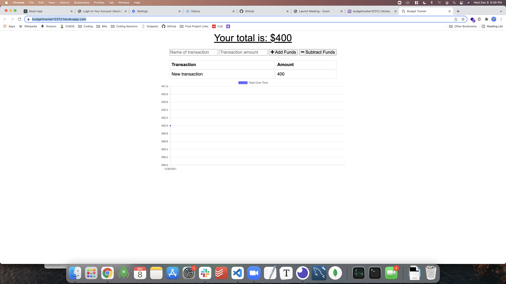

# Book_Search_Engine

Hello! This repo is an exercise completed for the U of MN fullstack web dev bootcamp. 

Given some starter code, this assignment required altering a budget app using index db to make it a "progressive web app." This project uses node, express, and MONGO DB to allow the site to be installed and used offline. 

[Visit the deployed site here!](https://budgettracker12313.herokuapp.com/)

Author: [@Brendan838](https://github.com/Brendan838)
